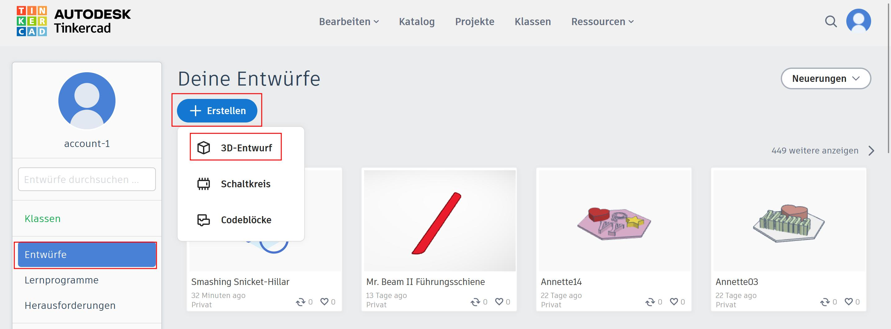
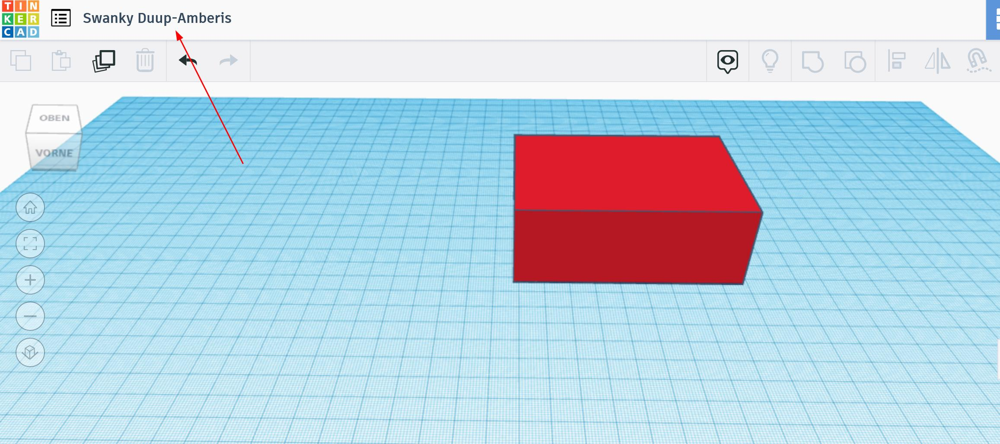
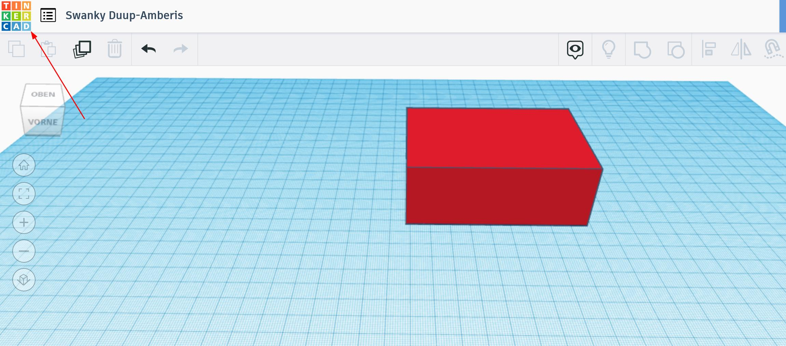
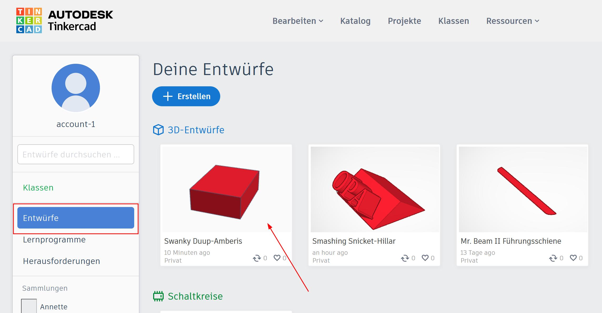
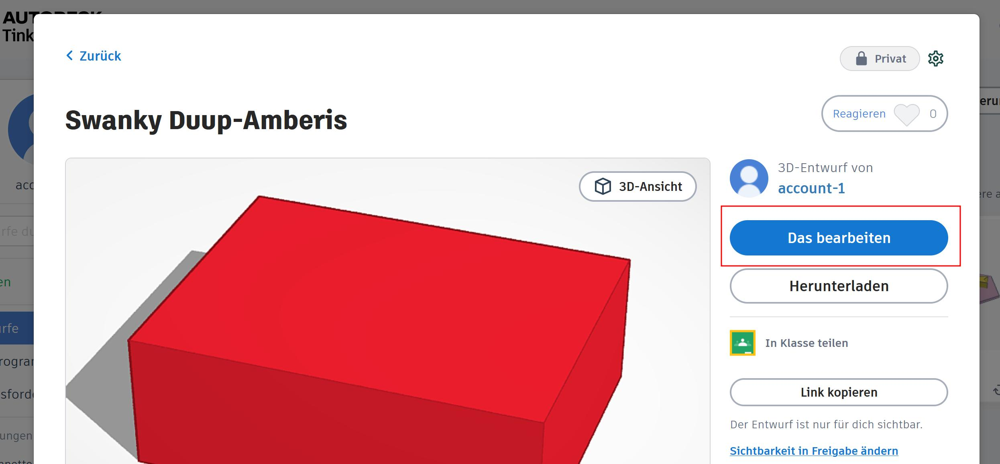
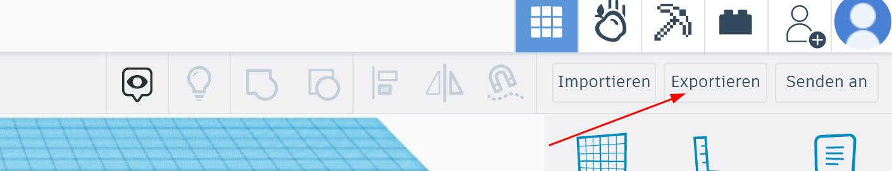
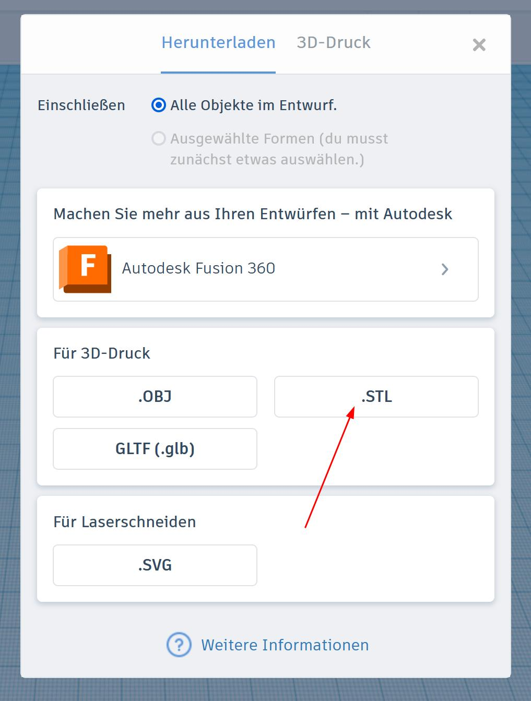
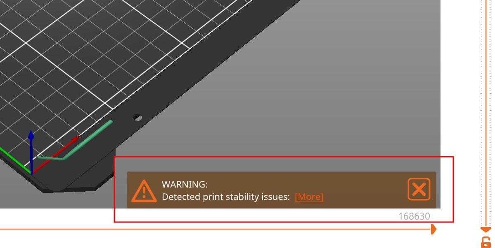
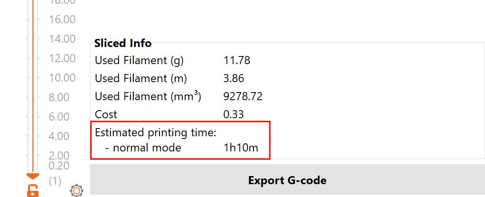

# 3D-Druck

Mit den 3D-Druckern im Digitallabor kannst du verschiedendste Figuren und Vorlagen drucken. Dazu benutzt du das Programm [Tinkercad](https://www.tinkercad.com/). Die Zugangsdaten dazu findest du im Makerspace an der Magnetwand.

## Neues Projekt erstellen

Du kannst ein neues Projekt erstellen, indem du links im Bereich "Entwürfe" auf "+ Erstellen" und dann "3D-Entwurf" klickst

Damit du deinen Entwurf beim nächsten mal wiederfindest, kannst du ihn mit einem Klick auf den Namen links oben umbenennen.

Um zum Menü zurückzukommen, kannst du oben auf das Tinkercad-Logo klicken. Dein Entwurf wird unter dem angegebenen Namen automatisch gespeichert.

## Modellieren

Um neue Objekte hinzuzufügen, kannst du rechts Formen per drag-and-drop in die Mitte ziehen.
Du kannst die Ansicht rotieren, indem du die rechte Maustaste gedrückt hältst. Wenn du die mittlere Maustaste gedrückt hältst, kannst du die Ansicht verschieben.

Um Formen aus anderen Formen herauszuschneiden, kannst du "Bohrungen" (die grau schraffierten Formen) über die bestehenden Formen ziehen, beide markieren und oben in der Leiste mit dem "Gruppieren" Symbol zusammenführen.

## Vorhandenes Projekt laden

Du kannst an einem Projekt, das du zum Beispiel beim letzen Lab angefangen hast, weiterarbeiten, indem du im Entwürfe-Bereich auf dein Projekt klickst.

Daraufhin öffnet sich ein Popup mit der detailierten Projektbeschreibung. Klicke auf "Das bearbeiten", um das Projekt im 3D-Editor zu öffnen.

## Inspiration

Um dir Ideen für eigene Projekte zu holen, kannst du zum Beispiel auf der Webseite [Printables](https://www.printables.com/de) vorbeischauen. Dort kannst du dir kostenlos 3D-Modelle anderer Personen anschauen und sogar herunterladen & in dein Projekt einfügen.

## Drucken

Um dein Projekt zu drucken, musst du rechts oben auf "Exportieren" klicken.

Daraufhin öffnet sich ein Popup, in dem du auf den Button ".STL" klickst. 

Jetzt kann es ein bisschen dauern bis das Programm deine Anfrage verarbeitet hat. Es sollte sich aber bald ein Fenster öffnen, in dem du die Datei auf deinem PC speichern kannst.
Anschließend musst du diese Datei in dem Programm "PrusaSlicer" importieren.

## Prusa Slicer

Suche auf PC nach dem Programm "PrusaSlicer" und öffne es. Falls es nicht installiert ist, melde dich bei eine\*r Mentor\*in und wir installieren es zusammen.
Sobald PrusaSlicer offen ist, kannst du die Datei, die du aus Tinkercad exportiert hast, mit der Maus in das Programm hineinziehen.
Wenn du unten rechts auf "Jetzt Slicen" drückst, berechnet das Programm, wie es dein 3D Objekt drucken wird. Falls dir unten in der Mitte eine Warnung angezeigt wird (siehe Screenshot unten), müssen wir zusammen weitere Stützen einfügen.

Sobald alle Warnungen beseitigt sind, bist du bereit zu drucken. Wenn du auf der rechten Seite nach unten scrollst, kannst du die geplante Druckzeit sehen.

Entferne jetzt die SD-Karte aus dem 3D-Drucker, den du benutzen willst, und stecke sie in deinen Laptop. Auf der rechten Seite sollte ein Steckplatz dafür sein. Sobald der Laptop die SD-Karte erkannt hat, kannst du im PrusaSlicer auf "Export G-code" drücken und die G-code Datei auf der SD-Karte speichern.

Entferne sie jetzt aus deinem Laptop und stecke sie wieder in den 3D-Drucker. Mit dem Auswahlrad kannst du deine G-code Datei auf dem Display des 3D-Druckers auswählen. Drücke es nach innen, um deine Auswahl zu bestätigen. Der 3D-Drucker fängt jetzt an, sich aufzuwärmen und dein 3D-Objekt zu drucken.