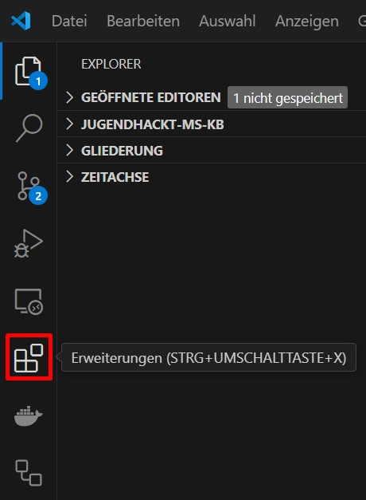
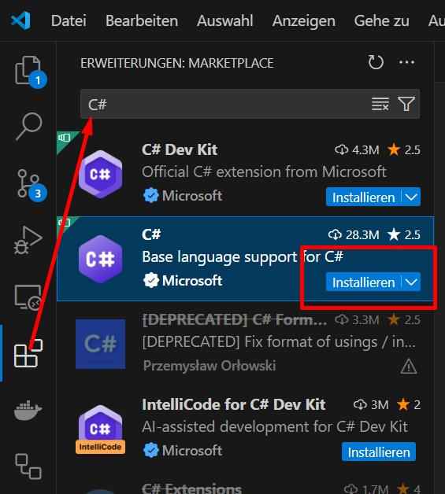
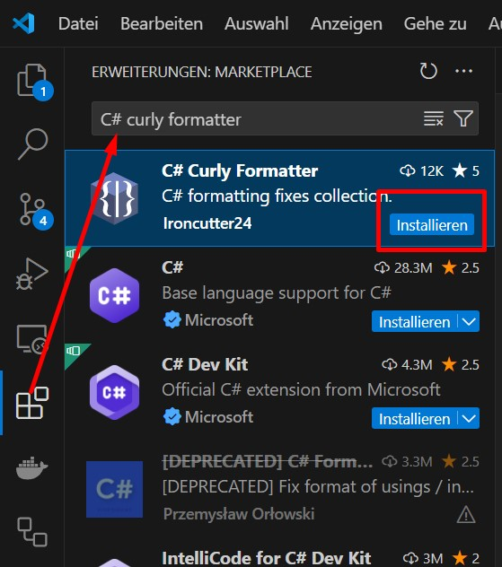

# PC Setup

Um anzufangen mit C# zu entwickeln, musst du folgende Dinge installieren:
1. [.net 8.0 SDK x64](https://dotnet.microsoft.com/en-us/download)*
2. [Visual Studio Code](https://code.visualstudio.com/)
3. Folgende Visual Studio Code Erweiterungen: C#, C# Curly Formatter

\* Ein SDK (Software Development Kit) ist eine Sammlung von Tools, Bibliotheken und Dokumentationen, die EntwicklerInnen helfen, Anwendungen zu erstellen, indem sie vorgefertigte Funktionen bereitstellen.

Visual Studio Code ist ein Code-Editor, in dem du später all deinen Code schreiben und ausführen wirst.

## Installieren von Visual Studio Erweiterungen

Visual Studio Code Erweiterungen können über den Menüpunkt "Erweiterungen" am linken Bildschirmrand durchsucht werden.

In diesem Menü können oben über die Suchleiste alle Erweiterungen für Visual Studio Code durchsucht und durch Klick auf "Installieren" installiert werden.

