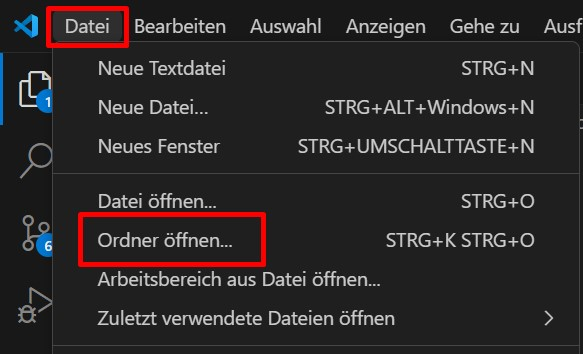
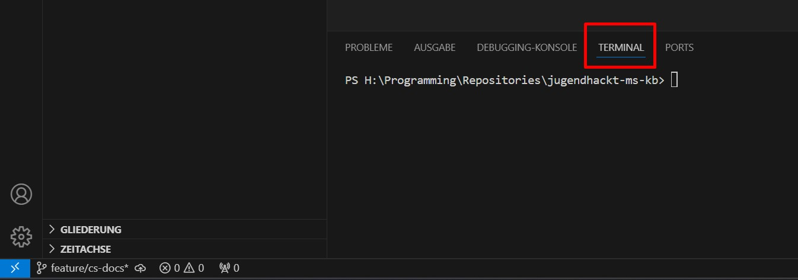
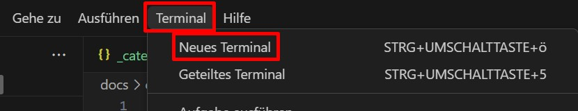
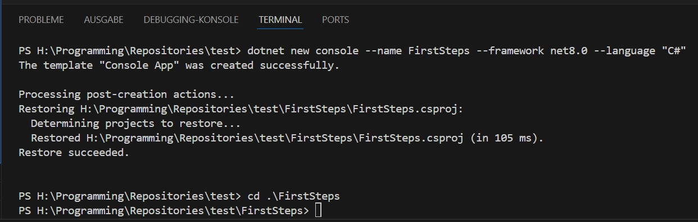
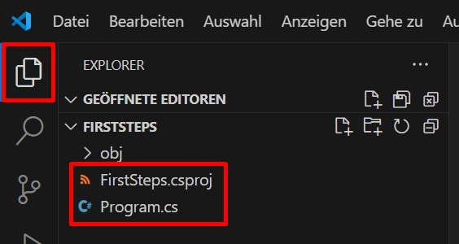
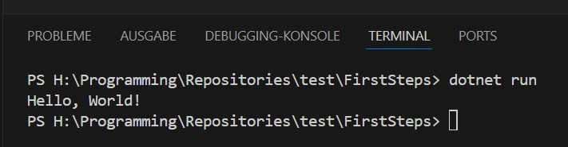
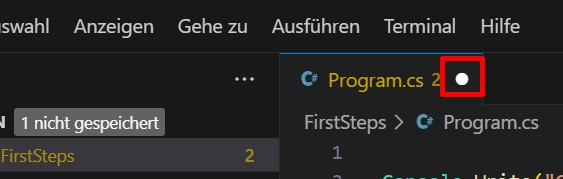

# Erste Schritte

## Das Terminal

Zuerst öffnest du in Visual Studio Code (VSCode) den Ordner, in dem du das Projekt abspeichern möchtest. Hier werden alle Projekt- und Codedateien später liegen.



Wähle am unteren Bildschirmrand den Reiter "Terminal" aus. Falls der Reiter nicht offen sein sollte, kannst du ihn oben über das Menü `Terminal` -> `Neues Terminal` öffnen.





Im Terminal kannst du direkt Befehle an den Computer geben, die im aktuellen Ordner ausgeführt werden (Im Screenshot oben ist das Terminal beispielsweise im Ordner `H:\Programming\Repositories\jugendhackt-ms-kb` geöffnet).

## Das erste Projekt

Um C# auszuführen, brauchst du zuerst ein sogenanntes 'Projekt'. Das kannst du erstellen, indem du im Terminal folgenden Befehl ausführst: 
```ps
dotnet new console --name FirstSteps --framework net8.0 --language "C#"
```

Dadurch erstellst du ein neues Projekt mit dem Namen 'FirstSteps' in der aktuellsten Version von C#.

Danach musst du noch `cd .\FirstSteps` im Terminal ausführen, um in den eben erstellten `FirstSteps` Ordner zu gehen (ansonsten kannst du später das Programm nicht starten). Der Befehl `cd` steht für "change directory", also "wechsel den Ordner".



Jetzt solltest du mehrere Dateien links im Explorer sehen



Die Datei `FirstSteps.csproj` ist für dich vorerst irrelevant. Sie wird später dazu benutzt, um andere Projekte zu verknüpfen.<br/>
`Program.cs` ist die wichtigere Datei. Die Dateiendung `.cs` gibt an, dass es sich um eine C#-Datei handelt und dadurch ausführbaren Code beinhaltet. Standardmäßig ist sie am Anfang mit einer Codezeile gefüllt, die bei Ausführung den Text `Hello, World!` in die Ausgabe schreibt:
```cs
Console.WriteLine("Hello, World!");
```

Um den Code in der Datei auszuführen, kannst du im Terminal den Befehl `dotnet run` ausführen


Jetzt bist du bereit, Code auszuführen und wir können uns auf das Schreiben von Programmen konzentrieren!

## Progamm abbrechen
Manchmal willst du die Ausführung des Programms abbrechen bevor es sich selbst beendet. Das kannst du machen, indem du in das Terminal klickst und `strg` + `c` drückst.

## Datei speichern

Eine wichtige Sache noch: **VSCode speichert deine Eingaben nicht automatisch**. Du musst selbst in die Datei klicken und `strg` + `s` auf der Tastatur drücken, um sie zu speichern. Andernfalls hat die Ausführung von `dotnet run` nicht den aktuellsten Code.

Du erkennst, dass eine Datei ungespeicherte Änderungen hat, wenn dieser Punkt oben neben dem Dateinamen steht. Nach dem Speichern verschwindet er.



## Fehler beheben
Programmcode ist sehr strikt und folgt starken Regeln. Wenn du hier mal ein `;` vergisst oder dort eine Klammer falsch setzt, kann dein Programm nicht ausgeführt werden. Aber: Der Computer ist dein Freund. Er sagt dir genau, wo der Fehler ist, auch wenn die Fehlermeldung ab und an etwas kryptisch sein mag. In diesem Beispiel ist das Problem in Zeile 7, Spalte 27.


Meistens siehst du aber auch im Code selbst eine rote Markierung, die dir anzeigt, dass dort etwas nicht stimmt.