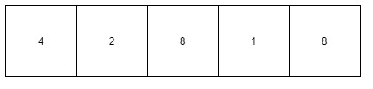
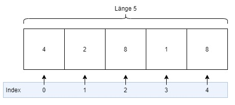

# Arrays

Arrays sind eine Ansammlung von Daten des gleichen Typs. Da sie eine feste Länge haben, kannst du sie dir ein bisschen wie eine Regalreihe mit einzelnen Fächern vorstellen. In jedem Fach kannst du einen Wert speichern und laden.



Im Code sieht das dann so aus:
```cs
int[] numbers = [4, 2, 8, 1, 8];
```

Lass uns diese Zeile analysieren.

`int[]` ist der Datentyp. Die eckigen Klammern hinter `int` geben an, dass es ein Array aus `int` Werten ist. Das kannst du mit jedem Datentyp machen. `string[]` wäre ein string-Array und `bool[]` ein bool-Array. Du kannst nur Werte des richtigen typs in ein Array schreiben, sprich: Es ist nicht möglich ein bool (`true`) oder einen string (`"Ich bin ein string"`) in ein int-Array zu speichern.

Der Teil auf der Rechten Seite der Zuweisung (`[4, 2, 8, 1, 8]`) ist der Wert des Arrays. Es hat eine Länge von fünf, weil fünf Zahlen in den eckigen Klammern stehen. Im ersten "Regalfach" des Arrays steht eine 4, im zweiten eine 2, im dritten eine 8, etc.

## Zugriff

Dass die Werte dort gespeichert werden, ist schön, aber wir müssen wieder darauf zugreifen können, um sie zu benutzen. Das machen wir wieder mit eckigen Klammern. Im Folgenden extrahieren wir die Zahl 4 aus dem Array und geben sie auf der Konsole aus.
```cs
int[] numbers = [4, 2, 8, 1, 8];
var number = numbers[0];

Console.WriteLine(number);
```

Jetzt kommt ein wichtiges Konzept von Arrays. Normalerweise würdest du sagen, die 4 liegt im ersten "Regalfach". <b>Aber Positionen in Arrays fangen immer bei 0 an</b>.<br/>
- 4 hat damit Position 0.<br/>
- 2 hat die Position 1.<br/>
- Die erste 8 hat die Position 2.<br/>
- 1 hat die Position 3.<br/>
- Die zweite 8 hat die Position 4.<br/>

Diese Positionen nennt man auch <b>Index</b>.



Das bedeutet insgesamt auch, dass der letzte Index immer die Länge des Arrays - 1 ist. In unserem Fall ist das Array 5 Felder lang und sein letzter Index ist 4 (= 5-1).

> Wie müsstest du obigen Code verändern, damit die Zahl 1 ausgegeben wird? Probiere es doch mal aus!<br/>
Versuche auch mal, auf einen Index größer als 4 zuzugreifen. Was macht das Programm dann?

Du musst aber nicht immer auswendig wissen, wie lang ein Array ist. Mit der `.Length` Eigenschaft kannst du die Länge des Arrays abfragen und im Code benutzen. Das ist später nützlich, wenn du z.B. mit einer `for`-Schleife durch ein Array gehen willst.<br/>
Welche Zahl denkst du, steht damit in der Konsole des unteren Codes? "ist <b>4</b> Felder lang" oder "ist <b>5</b> Felder lang"? Kopier den Code in VSCode und überprüfe es!
```cs
int[] numbers = [4, 2, 8, 1, 8];

var length = numbers.Length;

Console.WriteLine("Das Array ist " + length + " Felder lang");
```

### Rechnen

Wenn wir auf einzelne Positionen in Arrays zugreifen können, können wir mit ihnen auch rechnen. Hier ein Beispiel, in dem wir 4 + 2 + 8 rechnen:
```cs
int[] numbers = [4, 2, 8, 1, 8];
var number1 = numbers[0]; // 4 bei Index 0
var number2 = numbers[1]; // 2 bei Index 1
var number3 = numbers[4]; // 8 bei Index 4

var result = number1 + number2 + number3;

Console.WriteLine(result);
```

Natürlich können wir den Zugriff auch direkt benutzen und müssen ihn nicht in einer Variable speichern:

```cs
int[] numbers = [4, 2, 8, 1, 8];

var result = numbers[0] + numbers[1] + numbers[4];

Console.WriteLine(result);
```

## Speichern

Du kannst bestehende Werte in einem Array auch überschreiben. Wie bei normalen Variablen machen wir das wieder mit einer Zuweisung, wobei wir den Index angeben müssen, den wir überschreiben wollen.
```cs
int[] numbers = [4, 2, 8, 1, 8];
numbers[2] = 9;
```

Dadurch steht an Index 2 jetzt eine 9 (anstatt einer 8) und das Array sieht wie folgt aus: `[4, 2, 9, 1, 8]`