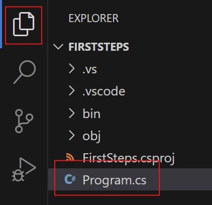
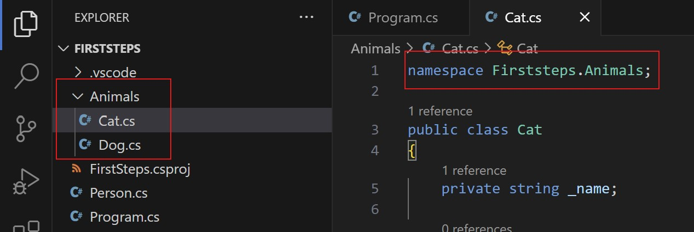

# Namespaces

Im vergangenen Kapitel haben wir Klassen kennengelernt und vielleicht ist dir dabei schon aufgefallen, dass der Code sehr lang werden kann, wenn die Klasse größer wird oder man mehrere Klassen hat. Um die Übersicht zu behalten, ist es möglich, Klassen in andere Dateien zu schreiben.

Nehmen wir nochmal den Code mit der Klasse `Person`

```cs
var tom = new Person("Tom", 14);
Console.WriteLine("Tom ist " + tom.Age + " Jahre alt");

tom.CelebrateBirthday(); // Erhöht Alter um 1
Console.WriteLine("Tom ist " + tom.Age + " Jahre alt");

public class Person
{
    private string _name;
    private int _age;

    public Person(string name, int age)
    {
        _name = name;
        _age = age;
    }

    public string Name => _name;
    public int Age => _age;

    public void CelebrateBirthday()
    {
        _age++;
    }
}
```

Wenn du links in VS Code in den Datei-Explorer schaust, siehst du aktuell, dass du nur eine Datei `Program.cs` hast. Die Dateiendung `cs` gibt an, dass es sich um eine C#-Datei handelt.



Jetzt wollen wir die Klasse `Person` in eine neue Datei verschieben. Dafür legen wir eine Datei `Person.cs` (Rechtsklick in den Datei-Exporer -> Neue Datei...) an. Es empfiehlt sich immer, die Datei so zu benennen, wie die Klasse darin heißt, um schnell sehen zu können, was der Inhalt der Datei ist.<br/>
Sobald du die Datei erstellt hast, kannst du die komplette Klasse `Person` in die neue Datei kopieren und aus der `Program.cs` löschen.

Deine `Program.cs` sieht jetzt so aus:
```cs
var tom = new Person("Tom", 14);
Console.WriteLine("Tom ist " + tom.Age + " Jahre alt");

tom.CelebrateBirthday(); // Erhöht Alter um 1
Console.WriteLine("Tom ist " + tom.Age + " Jahre alt");
```

Und deine `Person.cs` so:
```cs
public class Person
{
    private string _name;
    private int _age;

    public Person(string name, int age)
    {
        _name = name;
        _age = age;
    }

    public string Name => _name;
    public int Age => _age;

    public void CelebrateBirthday()
    {
        _age++;
    }
}
```

Wenn du jetzt `dotnet run` ausführst, läuft das Program wie vorher.

Damit haben wir die Klasse in eine andere Datei geschoben, aber noch keine Namespaces. Das ist der nächste Schritt. Namespaces sind dafür da, Bereiche innerhalb eines Programms zu schaffen, die Klassen beinhalten können. Das kannst du dir ein bisschen wie Werkzeuge (Klassen) in Werkzeugkästen (Namespaces) vorstellen. Dadurch kannst du dem Programm später sagen, es soll nur die Werkzeugkästen benutzen, die du auch wirklich brauchst.

Zunächst müssen wir die Klasse `Person` einem Namespace zuweisen. Das machen wir, indem wir über der Klasse `namespace`, gefolgt von dem Namen des Namespaces schreiben:

```cs
namespace Firststeps;

public class Person
{
    private string _name;
    private int _age;

    public Person(string name, int age)
    {
        _name = name;
        _age = age;
    }

    public string Name => _name;
    public int Age => _age;

    public void CelebrateBirthday()
    {
        _age++;
    }
}
```

In diesem Fall haben wir den Namespace `Firststeps` genannt, weil das Projekt so heißt. Wenn du jetzt nochmal versuchst, `dotnet run` auszuführen, wird der Computer dir einen Fehler anzeigen und sagen, dass er `Person` nicht mehr erkennt. Das beheben wir, indem wir Namespaces importieren.

## Importieren

Um den eben beschriebenen Fehler zu beheben, muss die Datei `Program.cs` wissen, dass sie Klassen aus dem Namspace `Firststeps` benutzen soll. Das schaffst du, indem du ganz oben in `Program.cs` `using Firststeps;` schreibst. `using` sagt dem Computer, dass gleich ein Namespace kommt, den er in dieser Datei benutzen soll und `Firststeps` ist der Name des Namespace.

```cs
using Firststeps;

var tom = new Person("Tom", 14);
Console.WriteLine("Tom ist " + tom.Age + " Jahre alt");

tom.CelebrateBirthday(); // Erhöht Alter um 1
Console.WriteLine("Tom ist " + tom.Age + " Jahre alt");
```

Führe jetzt nochmal `dotnet run` aus. Der Computer sollte keinen Fehler mehr werfen.

Wichtig zu wissen ist, dass Dateien kein `using` brauchen, um Klassen im gleichen Namespace zu benutzen. Wenn du also eine weitere Klasse, zum Beispiel `Animal`, in einer anderen Datei, aber im gleichen Namespace `Firststeps` hättest, könntest du in der Klasse `Person` direkt auf `Animal` zugreifen, ohne `using Firststeps;` oben in `Person.cs` zu schreiben.

## Verschachtelte Namespaces

Namespaces geben dem Projekt eine Struktur. Daher orientieren sie sich meistens anhand von Ordnern: Der Namespace im obersten Ordner heißt so wie das Projekt (`Firststeps` in unserem Fall) und alle Unterordner bekommen ihren eigenen Namespace.

Hier ein kleines Beispiel. Wir haben einen Unterordner `Animals`, der zwei Klassen `Dog` und `Cat` beinhaltet. Da der Unterordner `Animals` heißt, nennen wir den Namespace `Firststeps.Animals`.



Beachte bitte, dass eine Klasse niemals den gleichen Namen wie ihr eigener Namespace haben darf. Du kannst also z.B. keine Klasse `Animals` im Namespace `Firststeps.Animals` erstellen. Die Klasse `Animal` allerdings schon. Deshalb werden Namespaces meistens als Plural formuliert.