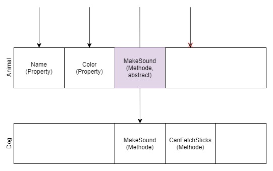

# Polymorphismus

Polymorphismus lässt dich in Subklassen das Verhalten der Basisklasse überschreiben. Schauen wir uns das wieder am Beispiel der Tiere an.

## Methoden vererben & überschreiben

Bisher haben wir nur Felder und Properties vererbt von der Basisklasse `Animal` an die Subklassen `Dog` und `Cat` vererbt. Mit Methoden funktioniert das aber genauso. Wir können eine Methode `MakeSound` in `Animal` definieren und dann auf einem `Dog` (oder `Cat`) Objekt aufrufen.

```cs
// Animals/Animal.cs
namespace Firststeps.Animals;
public abstract class Animal
{
    protected string _name;
    protected string _color;
    
    public Animal(string name, string color)
    {
        _name = name;
        _color = color;
    }

    public string Name => _name;
    public string Color => _color;

    public void MakeSound()
    {
        Console.WriteLine("beep");
    }
}
```

```cs
// Program.cs
using Firststeps.Animals;
var dog = new Dog("Fiffi", "grau-braun", true);
dog.MakeSound();
```

Nun geben zwar Katzen und Hunde Laute von sich, macht aber beide nicht "beep". Da beide Tierarten unterschiedlich klingen, können wir also nicht in der Basisklasse `Animal` eine Implementierung für beide benutzen (wie hier die Ausgabe von "beep"). Das scheint jetzt zu bedeuten, dass `Dog` und `Cat` jeweils ihre eigene Methode `MakeSound` haben müssen. Und das stimmt im Prinzip auch - allerdings kann die Basisklasse beide zwingen, diese Methode zu implementieren. Mit `abstract`.

Wir entfernen die Implementierung von `MakeSound` und fügen ein `abstract` in die Methodensignatur ein.

```cs
// Animals/Animal.cs
namespace Firststeps.Animals;
public abstract class Animal // Animal muss abstract sein
{
    protected string _name;
    protected string _color;
    
    public Animal(string name, string color)
    {
        _name = name;
        _color = color;
    }

    public string Name => _name;
    public string Color => _color;

    public abstract void MakeSound(); // hier den Strichtpunkt nicht vergessen
}
```

Dadurch sagt `Animal` dem Computer: Ich habe eine Methode `MakeSound` aber meine Subklassen müssen sie jeweils für sich implementieren. Das kannst du allerdings nur in Klassen machen, die `abstract` sind. Wenn `Animal` hier nicht `abstract` wäre, könntest du keine `abstract` Methode definieren.

Das muss dann z.B. in `Dog` passieren (ansonsten wirft der Computer wieder einen Fehler). Um zu signalisieren, dass die Methode `MakeSound` implementiert wird, weil die Basisklasse das will, benutzen wir das Wort `override` in der Methodensignatur in `Dog`.
```cs
// Animals/Dog.cs
namespace Firststeps.Animals;
public class Dog : Animal
{
    private bool _canFetchSticks;
    
    public Dog(string name, string color, bool canFetchSticks)
        : base(name, color)
    {
        _canFetchSticks = canFetchSticks;
    }
    
    public bool CanFetchSticks => _canFetchSticks;

    public override void MakeSound() // <- override anstatt abstract
    {
        Console.WriteLine("Wuff!");
    }
}
```

Die Implementierung in `Cat` sieht analog aus, nur dass sie `Miau` ausgibt.

Dadurch bekommen wir jetzt `Wuff!` als Ausgabe, wenn wir folgenden Code ausführen
```cs
// Program.cs
using Firststeps.Animals;
Dog dog = new Dog("Fiffi", "grau-braun", true);
dog.MakeSound();
```

Vielleicht fragst du dich aber, warum das nötig ist. Schließlich hätten wir auch einfach in `Dog` und `Cat` jeweils eine `MakeSound` Methode implementieren können, ohne das `abstract` und `override`. Den Grund dafür ist eine weitere Eigenschaft des Polymorphismus.

## Hund oder Katze? Mir doch egal.

Nehmen wir nochmal den Code von eben her:

```cs
// Program.cs
using Firststeps.Animals;
Dog dog = new Dog("Fiffi", "grau-braun", true);
```

Die Variable `dog` ist vom Typ `Dog`. Daher können wir alle Properties & Methoden von `Dog` nutzen und zum Beispiel abfragen, ob der Hund Stöckchen holen kann:

```cs
// Program.cs
using Firststeps.Animals;
Dog dog = new Dog("Fiffi", "grau-braun", true);
Console.WriteLine("Kann der Hund Stöckchen holen? " + dog.CanFetchSticks);
```

Es gibt aber Situationen, in denen dir egal ist, ob du eine Katze, einen Hund oder einen Wellensittich behandelst. Es ist nur wichtig, dass es ein Tier ist. Sehen wir uns ein Beispiel an.

```cs
// Program.cs
using Firststeps.Animals;
Animal animal = new Dog("Fiffi", "grau-braun", canFetchSticks: true); // Datentyp ist jetzt 'Animal', nicht mehr 'Dog'
```

Hier speichern wir das `Dog`-Objekt, das wir mit `new Dog(...)` erzeugen, nicht in einer Variable vom Typ `Dog`, sondern in einer vom Typ `Animal`. Das ist möglich, da `Dog` von `Animal` erbt.<br/>
Sobald wir nun aber versuchen, das `CanFetchSticks` Property abzufragen, kommt ein Fehler.

```cs
// Program.cs
using Firststeps.Animals;
Animal animal = new Dog("Fiffi", "grau-braun", canFetchSticks: true);
Console.WriteLine("Kann der Hund Stöckchen holen? " + animal.CanFetchSticks); // Fehler
```

Der Computer findet `CanFetchSticks` nicht. Und das ist auch korrekt, da `CanFetchSticks` nicht Teil von der Klasse `Animal` ist, sondern nur in `Dog` existiert.



Du kannst dir `Animal` und `Dog` wie zwei Käsescheiben übereinander vorstellen. Auf die Properties `Name` & `Color` können wir von oben direkt am `Animal` zugreifen. An der Stelle von `MakeSound` hat `Animal` ein Loch und lässt uns zu der Implementierung in `Dog` durch, da die Methode als `abstract` markiert ist.<br/>
Wenn wir aber versuchen, auf `CanFetchSticks` zuzugreifen, lässt uns `Animal` nicht durch und verursacht einen Fehler.

Das mag vielleicht verwirrend sein, denn im Code erstellen wir ein `Dog`-Objekt und speichern es in der Variable. Aber laut Datentyp der Variable kann *irgendein* Tier darin gespeichert werden, das nicht unbedingt ein Hund ist. So ist möglich, das `Dog`-Objekt mit einem `Cat`-Objekt zu überschreiben.

```cs
// Program.cs
using Firststeps.Animals;
Animal animal = new Dog("Fiffi", "grau-braun", canFetchSticks: true); // Speicher einen Hund in 'animal'
animal = new Cat("Shadow", "schwarz", 3); // Überschreibe den Hund in 'animal' mit einer Katze
```

Damit wären wir bei der Wortbedeutung von "Polymorphismus": Etwas kann verschiedene Formen annehmen. In einer Variable vom Typ `Animal` können wir sowohl ein Objekt vom Typ `Dog` als auch von `Cat` speichern.

Und jetzt können wir auch die Ausgangsfrage beantworten: Warum ist es wichtig, dass `MakeSound` in `Animal` definiert wird?<br/>
Dieser Code funktioniert nur dann, wenn das der Fall ist.

```cs
// Program.cs
using Firststeps.Animals;
Animal animal = new Dog("Fiffi", "grau-braun", canFetchSticks: true);
animal.MakeSound();
```

Wenn die `Animal`-Basisklasse keine Kenntnis von `MakeSound` hätte, könnten wir in diesem Code die Methode nicht auf einer Variable vom Typ `Animal` aufrufen.